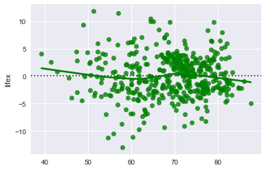
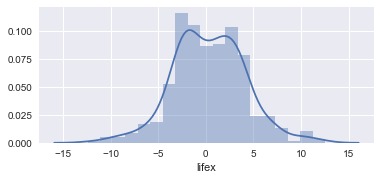
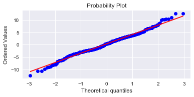

# Life Expectancy Project

### Team Members
Brayton Hall, Sailaja Karra

- [Data](#data)
- [EDA](#eda)
- [Model](#model)
- [Conclusions](#concl)

## Project Goals
Our aim was to determine the most important features for anticipating a country's life expectancy. Many features are economic in nature, and determining the most predictive ones may inform more effective resource allocation to increase life expectancy. 

## Data Collection 
Our data was collected via Kaggle from the World Health Organization's [Life Expectancy](https://www.kaggle.com/kumarajarshi/life-expectancy-who) dataset under its Global Health Observatory (GHO). Important features among 22 initial indepedent variables include:
- schooling
- adult mortality rate
- bmi
- income index
- HIV/AIDS ratio
- infant mortality
- gdp
- population

## EDA 

### Data Cleaning
We chose to drop 'Hepatitis B' due to missing values, as well as Country and Year because they were dominating other predictors. We then imputed median for 'schooling,', ''alcohol', 'GDP', and all economic features missing values. We turned our only binary categorical variable 'Status', into 0 or 1 for 'Developing' or 'Developed', and dropped all remaining missing values.

### Data Exploration
We noticed immediate strong correlations between the following features and our target variable (lifex): schooling .78, adult_mort -.67, bmi .59, status .51. Scatterplots showed a strong linear relationship with lifex. 

## Model & Results 
We used recursive feature engineering with cross validation, linear regression, Lasso L1, Ridge L2, and GridSearchCV to produce our best model : Ridge L2 (alpha: .01) with a root mean squared error of 3.69, meaning it is, on average, 3.69 days off when predicting the true values. Our residuals from the model are normally distributed and symmetric, indicating that the assumptions of linearity and homoscedasticity are met. 
### 
### 
### 

## Regression Analysis
Recursive feature elimination revealed the most important features in our model, with is the main driving factor for life expectancy. Followed by Schooling and negatively affected by HIV_AIDS.

Residuals are normally distributed 

## Conclusions 
From our Ridge L2 model, using recursive feature selection, we concluded that the most important features for determining a country's life expectancy is Schooling, Income 
